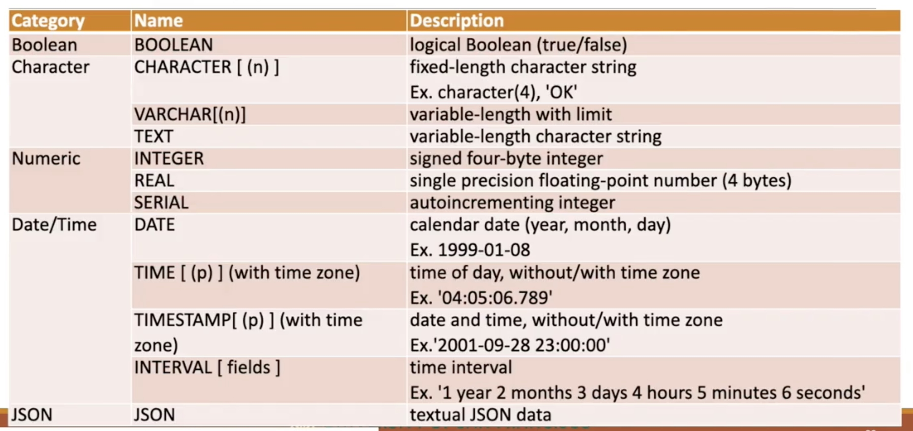
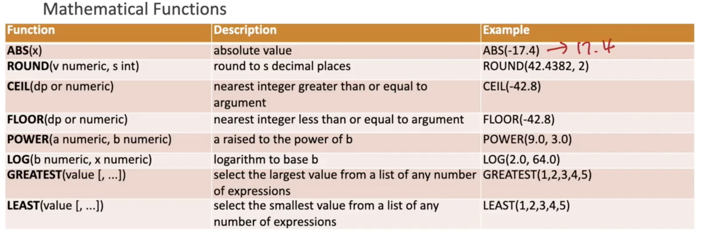
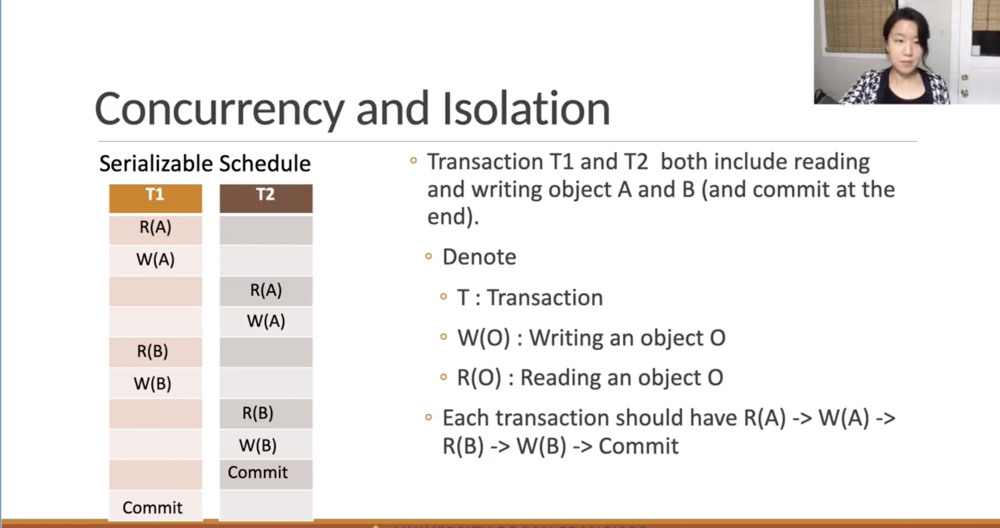

## Environment Setup

### Conda environment commands

conda create --name DistributedComputing python=3 -y

conda activate DistributedComputing

conda info --envs (this will list all available envs) <br>

conda list -n DistributedComputing (this will list all packages in the env)

conda deactivate

conda env list (this will list all available envs)

conda env remove --name DistributedComputing

conda env export  -n DistributedComputing --no-build > DistributedComputing_environment.yml

conda env create -f DistributedComputing_environment.yml -n DistributedComputing <br>

conda env update -f DistributedComputing_environment.yml -n DistributedComputing

### test suit
- pytest -vv
- pycodestyle hw1.py
- autopep8 --in-place --aggressive <filename<filename>>

### Git
- git remote -v (to check the url to push and pull data)

### Installation of postgresql

on terminal:
- setup
```
$ brew install postgresql@15
```
- initialize db (create the dirs if required)
```
$ initdb /usr/local/var/postgres 
```
- start the server on your local machine
```
$ postgres -D /usr/local/var/postgres
```
- to use terminal as an interface
```
$ psql postgres 
```
<br><br>


Connections using host, port, username(postgres)
- I would recommend installing one of these
    - pgadmin
    - DBeaver
    - SQuirrel
    - to use postgresql on jupyter lab/notebooks: ```$ conda install psycopg2```

## Database

A database is an organized collection of structured information, or data, typically stored electronically in a computer system [^1]

[^1]: <a target="_blank" rel="noopener noreferrer" href="https://www.oracle.com/database/what-is-database/">Oracle </a>

### DBMS

A DBMS serves as an interface between the database and its end users or programs, allowing users to retrieve, update, and manage how the information is organized and optimized. A DBMS also facilitates oversight and control of databases, enabling a variety of administrative operations such as performance monitoring, tuning, and backup and recovery.[^1]

### Why DBMS
1. Data Independence : The DBMS provides an abstract view of the data that hides details of data representation and storage.
2. Efficient Data Access : Store and retrieve data efficiently.
3. Data Integrity and Security : Enforce data integrity and access controls that governs what data is visible to different classes of users.
4. Data Administration : When several users share the data, it centralize the administration of data.
5. Concurrent Access and Crash Recovery : A DBMS schedules concurrent access to the data in such a manner that users can think of the data accessed by one user at a time. And The DBMS protects from the effects of system failures.
6. Reduced Application and Development Time : Provides functions to access data.

### RDBMS
- A relational database is a (most commonly digital) database based on the relational model of data, as proposed by E. F. Codd in 1970 [^2][^3]
- Based on a relational data model

### Relational Model
- A relational model organizes data into one or more tables (or "relations") of columns and rows, with a unique key identifying each row. Rows are also called records or tuples. Columns are also called attributes. Generally, each table/relation represents one "entity type" (such as customer or product). The rows represent instances of that type of entity (such as "Lee" or "chair") and the columns represent values attributed to that instance (such as address or price)
- Every relation has a schema or a description of the data which specifies its name, column/attribute/field name, type of data (e.g. string, int etc.), and integrity constraints (e.g. primary keys, unique keys foreign keys, other conditions etc.)

[^2]: <a target="_blank" rel="noopener noreferrer" href="https://en.wikipedia.org/wiki/Relational_database">Wikipedia RDBMS </a>
[^3]: <a target="_blank" rel="noopener noreferrer" href="https://dl.acm.org/doi/10.1145/362384.362685">EF Code 1970 paper </a>

<figure markdown>
  { width="300" }
  <figcaption>RDBMS ER model</figcaption>
</figure>

### 6 Steps of Relational DB Design
1. Requirements Analysis: find out what the users want from the DB
2. Conceptual DB Design: Develop a high-level description of the data to be stored (aka ER or Entity-Relationship diagram)
3. Logical DB Design: Convert the conceptual DB design into a DB schema
4. Schema Refinement: Identify potential problems and refine it
5. Physical DB Design: Ensure that the DB design meets desired performance criteria
6. Security Design: Define roles and identify the parts of the DB that should/should not be accessible by those roles

### ER Model (Entity-Relationship)
- This is done to describe entities or objects, their relationships and the constraints
- Entities are objects distinguishable from other objects
- An entity os described using a set of attributes
- Each attribute in an entity has a domain of possible values
- Primary key can be defined from here as:
    - Primary Key : A minimal set of attributes whose values uniquely identify an entity in the set
- Relationships are association among two or more entities
- Constraints
    - Key constraints : Restrict 1-1, 1-many, and many-many relationships
    - Participation Constraints : partial and total constraint
        - Total - Every instance of an entity is participating the relationship
        - Partial - The participation of an entity in the relationship is not total
        
Notes:
- ER designs are subjective in nature - meaning, there are multiple possible choices of design

## SQL

Most widely used language for creating, manipulating and querying RDBMS

- RDBMS uses dot notation when referring to database objects;
    - e.g. database.schema.table.column
- SQL ignores hard returns, additional white spaces and is generally case insensitive
- A statement ends with semicolon ;

### DDL

- Create a DB: ```CREATE DATABASE database_name;```
- Create a schema: ```CREATE SCHEMA schema_name;```

### CRUD
- Create
- Read
- Update
- Delete

### Keys

Super key: Attributes that can uniquely identify a tuple

Candidate Key: Minimal subset of Attributes that can uniquely identify a tuple

Unique Key: 
- Minimal subset of Columns that can uniquely identify a tuple
- Can be null
- Table can have multiple unique keys

Primary Key
- Minimal subset of Columns that can uniquely identify a tuple
- Can <b>Not</b> be null
- Only one primary key exists in a table

Foreign Key
- Info stored in a relation linked to the info stored in another relation
- If one gets modified, the other must be modified/checked to see consistency
- Foreign key in the referencing relation must match primay key in the referenced relation, however, names can be different

The data definition language deals with the schema creation and modification e.g., CREATE TABLE statement allows you to create a new table in the database and the ALTER TABLE statement changes the structure of an existing table.

The data manipulation language provides the constructs to query data such as the SELECT statement and to update the data such as INSERT, UPDATE, and DELETE statements.

The data control language consists of the statements that deal with the user authorization and security such as GRANT and REVOKE statements.

### Data Types

<div style="border-radius:10px; border : #682F2F solid; background-color:white; font-size:110%; padding-left:10px; text-align:left">
<h5> RDB Design</h5>
 <br>

<div style="border-radius:10px; border : #682F2F solid; background-color:white; font-size:110%; padding-left:10px; text-align:left">
<h5> RDB Design</h5>
 <br>

#### Cast operator
- cast(expression as target_type)
- expression::target_type

#### Type Conversion

<div style="border-radius:10px; border : #682F2F solid; background-color:white; font-size:110%; padding-left:10px; text-align:left">
<h5> RDB Design</h5>
 <br>

### Functions

<div style="border-radius:10px; border : #682F2F solid; background-color:white; font-size:110%; padding-left:10px; text-align:left">
<h5> RDB Design</h5>
 <br>

<div style="border-radius:10px; border : #682F2F solid; background-color:white; font-size:110%; padding-left:10px; text-align:left">
<h5> RDB Design</h5>
 <br>

<div style="border-radius:10px; border : #682F2F solid; background-color:white; font-size:110%; padding-left:10px; text-align:left">
<h5> RDB Design</h5>
 <br>


## Index Algorithms

### Database performance
Best way to store/find data for better performance

-DBMS: collection of records or a file, and each file consisting of one or more pages
- Page: Unit of information read from or written to disk
    - Page I/O dominates the cost of typical database operations
    - If we read pages in the order that the data is stored physically, the cost can be much less
- Record: Each record in a file has a unique identifier (Record ID or rid), to identify the address of the page containing the record
    - using rid, DBMS fetches the page including data from disk to memory
    
Best way to organize records in a file when the file is stored on the disk for fast access to desired subset of records

### Index:
- Data structure that organized data records on disk to optimize data retrievals using search key
- A good indexing algorithm improves query performance significantly

Some terminology:
- a data entry, k* is a data records stored in an index file
    - a data entry has a search key value k
    - a data entry contains information to locate data records with k
    
Clustered Indexes
- order of the data records is the same or close to the order of data entries
Unclustered Indexes
- order of the data records is not the same or close to the order of data entries

### Hash Index
- the records are grouped in buckets, where buckets consists of pages(s)
- the bucket that a record belongs to can be determined by applying hash function to the search key


### BTree Indexing
- Organize records using a self balancing tree structure
- data entries are arranged in sorted order by search key value
- a hierarchical search data structure is maintained that directs searches to the correct page of data entries
- all searches begin at the topmost node, and the contents of pages in non-leaf levels direct search to the correct leaf page
- all leaves that contain the data entries are at the same level and are pointed in a doubly-linked list

By default, Postgres doesn't maintain clustered index. We can cluster a table according to an index
```sql
CLUSTER table_name USING index_name
```
- When a table is clustered, it is physically reordered based on the index information. 
- Clustering is a one time operation, when the table is subsequently updated, the changes are not clustered


What indexes should we create/use?
- consider the most important/frequent query types. consider the best plan using the current indexes, and see if a better plan is possible with an additinal index
- attributes in WHERE clause are candidates for index keys
    - exact match or range
- composit index and their order
    - multi-attribute search keys should be considered when a WHERE clause contains several conditions
- before creating an index we must also consider the impact on indexes

### Factors affecting performance
- B = # of pages
- R = # of records per page
- D = Avg time to read or write to a disk page
- C = Avg time to process a record
- H = Time required to apply the hash function to a record
- F = Fan-Out (Avg # of children to a non-leaf node)

Test Results
No Index model
- Scan = B * (D + R*C)
- Search with equality selection = 0.5 * B * (D + R*C)
- Search with range selection = B * (D + R*C)
- Insert a Record = D + C + D = 2*D + C
- Delete a Record = Search with equality + C + D

Hash Index model
Assumption: each data entry is 10% of the size of a data record, and pages are about 80% occupancy <br>
Therefore: # of pages required to store data entries: <br>
4/5 full with 10% data entry size => (5/4 * B) * 0.1 = 0.125 * B <br>
And # of data entries that can fit in a page: <br>
4/5 * R * (1/10%) = 4/5 * R * 10 = 8*R

- Scan = 0.125 * B * (D + 8*R*C) + B*R * (D + C) = BD (R + 0.125) + 2BRC
- Search with equality selection = H + D + 0.5 * 8*R*C + D = H + 2*D + 4*R*C
- Search with range selection = B * (D + R*C)
- Insert a Record = H + 2*D + C + 2*D + C = H + 4*D + 2*C
- Delete a Record = Serch with equality + 2*D

BTree Index model (default for Postgress and other DBs)
Assumptions: Pages are usually 2/3 occupancy <br>
Therefore: # of pages = 3/2 pages = 1.5 * B <br>
Also, locate the page in $log_F$(1.5*B) * D and search the qualifying record in a page in $log_2$(R) * C
- Scan = 1.5 * B * (D + R*C)
- Search with equality selection = $log_F$(1.5*B) * D + $log_2$(R) * C
- Search with range selection = Equality selection + B
- Insert a Record = Search with equality + D
- Delete a Record = search with equality + D

d = {'IndexType':['no_index', 'hash', 'btree'],
    'Scan':['BD', 'BD(R + 0.125) + 2BRC', '1.5BD'],
     'EqualitySearch': ['0.5BD', '2D', r'D$\log_F$(1.5B)'],
     'RangeSearch': ['BD', 'BD', r'D$\log_F$(1.5B) + $log_2$(R) * C'],
     'Insert': ['2D', '4D', 'Search + D'],
     'Delete': ['Search + D', 'Search + 2D', 'Search + D']
    }

### Views
- a named query that provides a way to present data in the base tables
    - the view is not physically materialized, working with the base table
    - name of the view must be distinct from the name of any other view, table, index etc in the same schema
    - you can query a view just as you do with tables


### Transaction
- A unit of work which bundles multiple steps into a single operation
- a transaction is treated in a coherent and reliable way independent of other transactions
- foundation for concurrent execution and recovery from system failures

lookup `database transaction` in wikipedia.org and postgresql.org

postgresql:
- auto-commit: each successful query is committed after execution
- auto-rollback: failed queries are rolled back

## ACID

### Atomicity
- Actions in transactions are carried out all or none
    - DBMS logs all actions so that it can undo the actions of aborted transactions

### Consistency
- A transaction must change affected data, only in allowed ways, according to all defined rules

### Isolation
- When there are several transactions happening concurrently, users should be able to understand a transaction without considering the effect of other concurrently existing transactions

### Durability
- Once a transaction has been successfully completed, its effect should persist even if the system crashes before all its changes are reflected on ddisk

### Concurrency and Isolation

### Interleaved Transcations
- it allows multiple users of the DB to access it at the same time
- When there are multiple transactions, actions(reading, writing, aborting or committing) in transactions could be interleaved to improve performance
- Transaction schedule describes a list of actions from a set of transactions as seen by the DBMS
    - Serial Schedule: If the actions of different transactions are not interleaved and are executed from start to end one by one
    - Serializable Schedule: Over a set of committed transaction is a schedule whose effect is guaranteed to be identical to serial schedule

<div style="border-radius:10px; border : #682F2F solid; background-color:white; font-size:110%; padding-left:10px; text-align:left">
<h5> Clustering</h5>
 <br>
<!-- source: https://en.wikipedia.org/wiki/File:Cluster-2.svg -->

### Anomalies due to concurrency
- Interleaved execution can cause data object conflicts

4 types of conflicts
- dirty reads
- unrepeatable read
- phantom read (special case of unrepeatable read)
- lost update

### Lock
- An object that ensures the net effect is identical to executing all transactions in a serial order to minimize anomalies
- Types
    - shared lock
        - Does not prevent other transactions from acquiring the same shared lock
        - No update, delete or put an exclusive lock items on which any other transaction holds a shared lock
    - exclusive lock
        - prevents other transactions from accessing the data
        
Lock
- Performance of locked-based concurrency control
    - To resolve conflicts between transactions, it uses blocking and aborting.
        - Blocking : holds locks that force other transactions to wait. (Most)
        - Aborting : Stops and restarts a transaction.
- As more transactions execute concurrently, the likelihood of blocking goes up.
    - Solution : 
        - 1) lock the smallest side objects,
        - 2) reducing the time that transaction hold locks,
        - 3) reduce hotspots

## Anomalies due to concurrency

1.Write-Read(WR) Conflict
- Dirty Read: Transaction T2 could read a database object A that has been modified by another transaction T1 which has not yet committed. This can lead an inconsistent final database state.
- Postgres doesn’t support dirty read.

2.Read-Write(RW) Conflict
- Unrepeatable Read : A transaction T2 could change the value of an object that has been read by a transaction T1, while T1 is still in progress. If T1 tries to read the value again, it will get a different result

3.Read-Delete/Insert Conflict
- Phantom Reads
- Special case of unrepeatable reads.
- If the collection of database objects is not fixed, but can grow and shrink through the insertion and deletion of objects, the results differs from serial execution of T1 and T2

4.Write-Write(WW) Conflict
- Lost Update : For concurrent transactions, a transaction T2 could overwrite the value of an object A which has already been modified by a transaction T1

### Durability
- Write-Ahead Logging (WAL)
    - Any change to a database object is first recorded in the log before the change to the database object is written to disk.
    - Postgres way of logging actions.
    - A recovery algorithm that ensures data integrity.
    - Significantly reduce the number of disk writes, because only the log file needs to be flushed to disk.
    - Helps “Durability” of a database.

## Schema Refinement
- Data Redundancy and Anomalies
- Decomposition
    - 1NF
    - 2NF
    - 3NF

Recap
### Schema
- Schemas contain named objects including data types, functions, and operators.
- Help organize database objects into logical groups to make them more manageable.
- Are analogous to directories.
- You can check schema in your database.
    - SELECT *
    - FROM information_schema.columns

### Schema Refinement
Data redundancy could cause the following problems.
- Redundant storage : Some information is stored repeatedly.
- Update anomalies : If one copy of repeated data is updated, an inconsistency is created unless all copy are updated.
- Insert anomalies : It may not be possible to store certain information unless some other, unrelated, information is stored as well.
- Delete anomalies : It may not be possible to delete certain information without losing some other, unrelated. Information as well.

#### We need to consider Functional Dependency : If column A of a table uniquely identifies the column B of same table, Attribute B is functionally dependent on attribute A (A->B).
- eg hourly_wages are dependent on rating

<div style="border-radius:10px; border : #682F2F solid; background-color:white; font-size:110%; padding-left:10px; text-align:left">
<h5> Clustering</h5>
 <br>
<!-- source: https://en.wikipedia.org/wiki/File:Cluster-2.svg -->

Schema Refinement
Data redundancy could cause the following problems.
- Redundant storage : The rating value 9 corresponds to the hourly wage 25, and this association is repeated twice.
- Update anomalies :The hourly_wage in the first tuple could be updated without making a same change in the second tuple.
- Insert anomalies : We cannot insert a tuple unless we know the hourly wage or the employee’s rating.
- Delete anomalies : If we delete all tuples with a given rating value, we lose the association between the rating and hours_wage.

## Decompositions
Replacing a relation, R with two or more collection of smaller relations that each contain a subset of the attributes of R and together include all attributes in R.
- Functional dependency (FD) and other integrity constraints (ICs) can be used to refine the schema.
    - The set of all FDs implied by a given set F of FDs is called the closure of F, denoted as F+.
    - Armstrong’s Axiom (3) can be applied repeatedly to infer all FDs implied by a set F of FDs. When X,Y, and Z are sets of attributes over a relation schema R:
        - Reflectivity : If Y $\subseteq$ X, then X => Y.
        - Augmentation : If X => Y, then XZ => YZ for any Z.
        - Transitivity : If X => Y and Y => Z, then X => Z.
- Should satisfy
    - Lossless-join: We can recover the original relation from the decomposed relations.
    - Dependency-preservation: If R is decomposed into X, Y and Z, and we enforce the FDs that hold on X, on Y and on Z, then all FDs that were given to hold on R must also hold.

<br><br>
On week 1, we designed database tables using an ER diagram.
- Defined entity, relationship and their attributes.
- Schemas from ER model can offer from redundancy.
- Need to refine the initial design by
    - 1) Taking the integrity constraints(ICs) into account more fully.
    - 2) Considering performance criteria.
    - 3) Considering typical workload and query types.

## Relational Database Design

6 Steps
1. Requirement Analysis : Find out what the users want from the database.
2. Conceptual Database Design : Develop a high-level description of the data to be stored. (ER diagram)
3. Logical Database Design : Convert the conceptual database design into a database schema.
4. Schema Refinement : Identify potential problems and refine it. (Normalization)
5. Physical Database Design : Ensure that the database design meets desired performance criteria.
6. Security Design : Define a role and identify the parts of the database that must/must not be accessible by the role

## Normalization
A technique for organizing data in a database to
- Minimize redundancy to reduce redundant storage issues and insert/ update/ delete anomalies.
- Ensure data integrity and consistency.
- Makes easier to access and maintain the data.

Can be accomplished through Normal Forms (NF).


<div style="border-radius:10px; border : #682F2F solid; background-color:white; font-size:110%; padding-left:10px; text-align:left">
<h5> Clustering</h5>
 <br>
<!-- source: https://en.wikipedia.org/wiki/Database_normalization -->

## Normal Forms
### First Normal Forms (1NF)
- A table has a primary key.
- A table has no repeating attributes or groups attributes.
- Problems 
    - still have insert/delete/update anomalies.

### Candidate Keys
Recap Week 1.
- Super Key - A set of attributes which can uniquely identify a row.
- Candidate Key - A minimal set of attributes which can uniquely identify a row.
- Primary Key - A minimal set of attributes which can uniquely identify a row. (Cannot be NULL)
- Unique Key - A candidate key which is not primary key, and could be multiple unique keys. Could be NULL

### Second Normal Forms (2NF)
- It is a 1NF.
- It does not have any non-prime attribute that is functionally dependent on any subset of candidate keys. (Every non-prime attribute is dependent on the whole of every candidate key)
- Non-prime attribute : attribute that is not a part of any candidate key
- Problems
    - slkjdhf

### Third Normal Forms (3NF)
- It is a 2NF.
- Every non-prime attribute is non-transitively dependent on every key.
- Transitivity : If X Y and Y Z, then X Z
- Algorithm
    1. Put the FDs in a standard form with a single attribute on the right side.
    2. Minimize the left side of each FD while preserving equivalence to F+.
    3. Delete redundant FDs.


